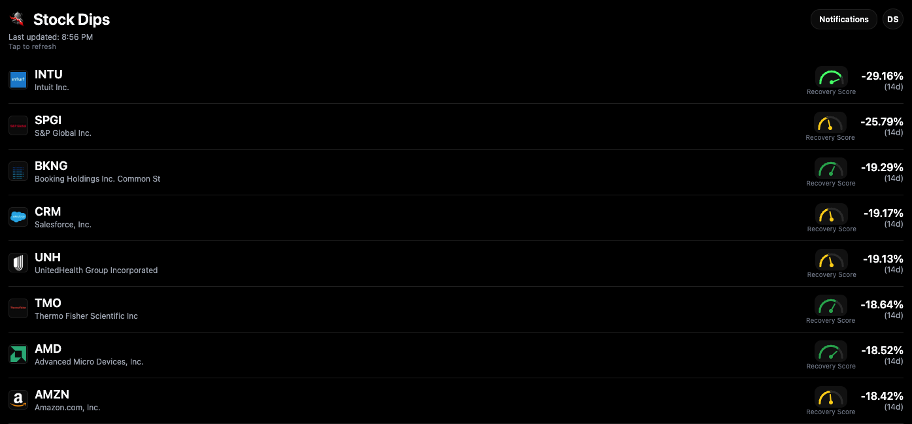
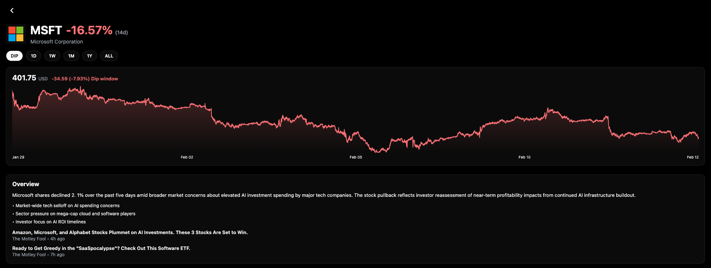
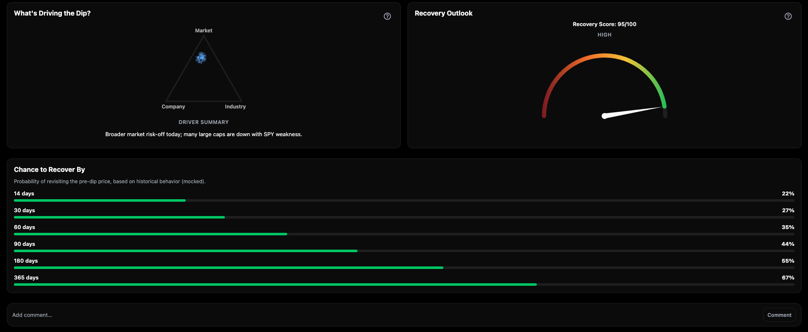

# Stock Dip Notifier

A market site that tracks stock drops and recovery outlooks for stocks.

**Live site**

[http://stock-dip-web-396341922613-use2.s3-website.us-east-2.amazonaws.com](http://stock-dip-web-396341922613-use2.s3-website.us-east-2.amazonaws.com)

Note: The live site may be broken at times because it’s under active development.

**What it does**
- Shows the current biggest dips across tracked tickers, sorted by severity.
- Opens a ticker detail view with price charts across multiple time ranges.
- Streams live intraday bars when the API WebSocket is available.
- Surfaces an overview summary and key factors from the API.
- Visualizes recovery score and drivers (currently mocked on the client).
- Includes notification settings UI (currently a stub).

**Tech at a glance**
- Web client: Expo + React Native Web.
- API: FastAPI + Postgres.
- Data provider: Massive (Polygon) for market data and news.
- AWS: S3 static website hosting for the web client + Lambda for AI overview caching.
- Local stack: Docker Compose for Postgres + API.

Note: The live site may be broken at times because it’s under active development.

**For developers**
See `docs/README-dev.md` for setup, environment variables, migrations, and local run commands.
